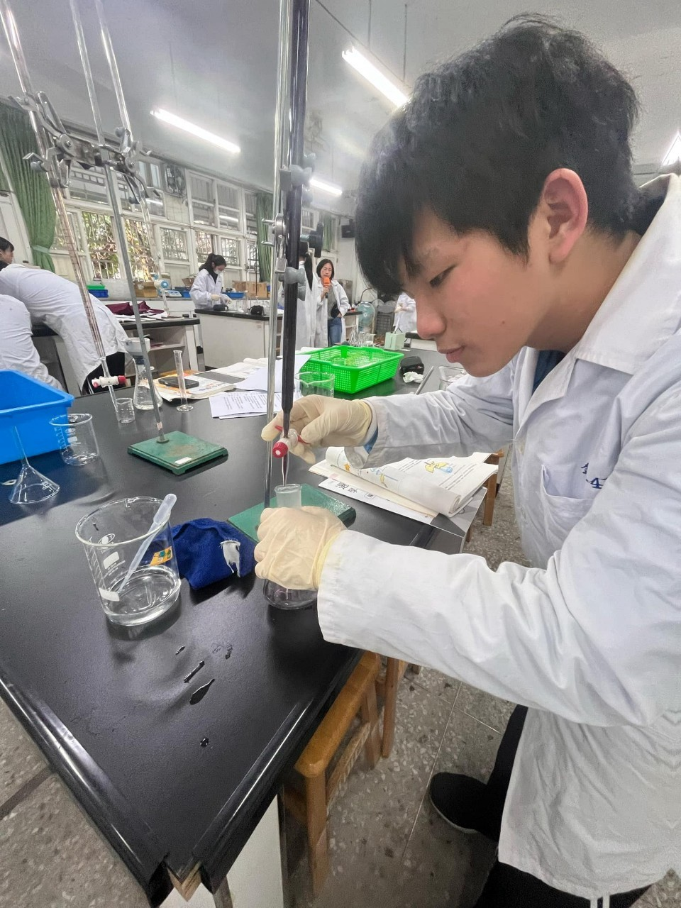

# resume.html.
<!DOCTYPE html>
<html lang="zh-Hant">
<head>
  <meta charset="UTF-8">
  <title>吳秉澤的個人履歷</title>
  
</head>
<body>
  

    <h1>吳秉澤的個人履歷</h1>
    
    <!-- 圖片路徑請依實際放置的檔案位置調整 -->
    

    

      
<strong>Email:</strong> hallow3096@gmail.com

      
<strong>電話:</strong> 0962077962

    

    

      <h2>技能</h2>
      <ul>
        <li>打掃</li>
        <li>煮飯</li>
      </ul>
    

    

      <h2>個人簡介</h2>
      
我來自新北中和，有一點點社交恐懼，但是不用認識多久就會很活潑，面對考試的心態是臨時抱佛腳。

    

    

      <h2>工作經歷</h2>
      
在補習班當過工讀生

    

    

      <h2>興趣</h2>
      <ul>
        <li>打遊戲</li>
        <li>看漫畫</li>
        <li>聽音樂</li>
      </ul>
    

  

</body>
</html>

    </main>
  

</body>
</html>
